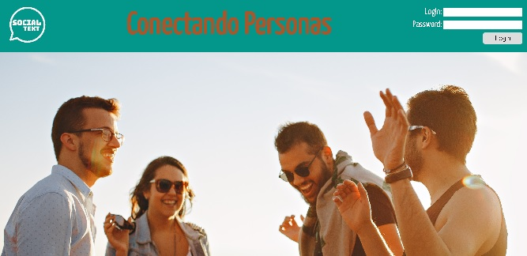
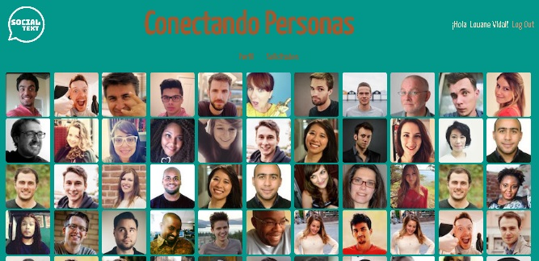

<p align=center></p>

This is  Bootcamp Web exercise of Keepcoding.

SocialText is a social network that allow people to share messages.

SocialText is a responsive web app and has been made using React and Redux.


## Installation

To install dependecies use:
```shell
npm install
```


## Database

The list of people is charged when rendering from the following API:

https://randomuser.me/api/?results=100&seed=abc

The rest os data like currentuser logged, subscription`s requets and messages are saved in LocalStorage

## Login

Each user has its own username and password from the API data.

If you want to try to log in with some user you can cheack the data in the APU URL or use these as an example:

```shell
Fullname: Louane Vidal
Username: angryostrich988
Password: r2d2

Fullname: Harry Thomas
Username: redpeacock807
Password: horndog
```


## Development

To start the application in development use:

```shell
npm start
```

## Production

To set the application for production using Webpack:

```shell
npm run build
```

## Deployment

This app has been deploy in Surge. If you want to test it in a production environmet go to the folloring URL:

http://socialtext.surge.sh/

## Views
### Main
<p align=center></p>

### Logged view
<p align=center></p>


